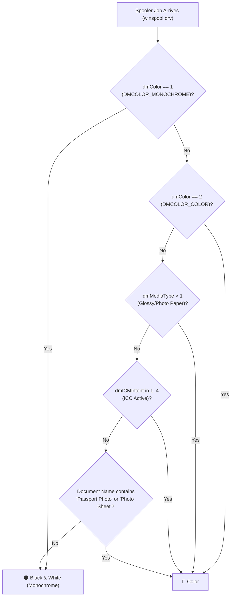

# DASMO CYBER CAFE TOOLS — Release Documentation

## Version 1.5.29: Universal Windows-Wide DEVMODE Color Detection & Interactive Toast HUD

---

### Executive Overview
Version **1.5.29** addresses a critical print spooler tracking bug where documents printed in **Color / High Quality** from applications such as **Adobe Acrobat**, **Google Chrome**, **Microsoft Edge**, **Microsoft Word**, **Windows Photo Viewer**, or **DASMO Passport Photo Studio** were falsely detected as `⚫ B&W` (Monochrome) instead of `🌈 Color`.

This release introduces an authoritative, multi-tier **Win32 DEVMODE evaluation engine**, provides an interactive **1-click override directly on the desktop HUD notification toast**, adds a dedicated safety net for photo sheets, and prepares the application for automated in-app updates.

---

### Root Cause Analysis

#### The Technical Issue in Earlier Versions (≤ v1.5.27)
In `PrintTrackerService.cs`, spooler DEVMODE parsing evaluated the print job's color mode using:
```csharp
if (devMode.dmColor == 1)
{
    isColor = false;
}
else if (devMode.dmICMIntent >= 1 && devMode.dmICMIntent <= 4)
{
    isColor = true;
}
else
{
    isColor = false; // <-- ROOT CAUSE BUG
}
```

#### Why Color Prints Were Detected as B&W:
1. **ICM Intent is Unset in Standard Windows Printing**:
   Standard Windows GDI / EMF printing applications (including Adobe Acrobat, Microsoft Office, web browsers, and image viewers) do **not** engage Image Color Management intent flags in the print job DEVMODE (`dmICMIntent` remains `0`).
2. **DEVMODE Color Flag Was Ignored**:
   When users configure "Color" or "High Quality", Windows and printer drivers (such as the Brother DCP-T530DW) set:
   * `dmColor = 2` (`DMCOLOR_COLOR`)
   * `dmPrintQuality = -4` (`DMRES_HIGH`) or `≥ 600 DPI`
   * `dmBitsPerPel = 24` or `32` (True Color)
3. Because `dmICMIntent == 0`, the previous code fell through to `else { isColor = false; }`, **forcibly converting every color print job into Black & White**.

---

### Comprehensive Architecture & Fixes (v1.5.29)

#### 1. Multi-Tier Win32 DEVMODE Color Detection Engine
A unified `EvaluateDevModeColor(DEVMODE devMode)` method now governs all print spooler polling and job inspection across Windows:



#### Detection Hierarchy Rules:
1. **Authoritative Monochrome (`dmColor == 1`)**:
   Standard Win32 `DMCOLOR_MONOCHROME`. When selected in Microsoft Word, Adobe Acrobat, Google Chrome, Edge, or Windows Printer Properties, this **authoritatively forces Black & White (Monochrome)**. Standard 600 DPI Brother laser/inkjet resolution and Windows GDI 24bpp rendering buffers are normal document attributes and no longer trigger false color alarms.
2. **Authoritative Color (`dmColor == 2`)**:
   Standard Win32 `DMCOLOR_COLOR`. Selected whenever color printing is requested from Acrobat, browsers, Office, or photo tools.
3. **Specialty / Photo Media (`dmMediaType > 1`)**:
   Glossy (`3`), Transparency (`2`), and Photo Paper (`4+`) categorize legacy/unflagged driver jobs as **Color**.
4. **Active Color Matching (`dmICMIntent in 1..4`)**:
   Active ICC color intents categorize unflagged legacy jobs as **Color**.
5. **Passport Photo Studio Safety**:
   Documents titled `DASMO Passport Photo Sheet` or containing `Photo Sheet` are safeguarded to always categorize as **Color**.
6. **Native Print Settings Synchronization**:
   In `NativePrintViewModel.cs`, both `pd.DefaultPageSettings.Color` and `pd.PrinterSettings.DefaultPageSettings.Color` are synchronized to prevent driver-level monochromatic overrides.

---

### 2. 1-Click Interactive Toast HUD Override

To give the cyber cafe operator immediate manual control without having to open the main studio:
* **Interactive Badges**:
  * **`[🌈 Color ⇋]` / `[⚫ B&W ⇋]`**: Click to toggle instantly between Color and B&W.
  * **`[📑 Duplex ⇋]` / `[📄 Single ⇋]`**: Click to toggle instantly between Duplex (2-in-1) and Single-Sided.
* **Instant Recalculation**:
  Clicking immediately recalculates the job cost, updates the customer's active cart in memory, and triggers background synchronization with the linked Excel accounts ledger.
* **Visual States**:
  * Color mode displays in gold/amber (`#F59E0B`).
  * B&W mode displays in cyan (`#00BCD4`).
  * Duplex displays in emerald green (`#10B981`).

---

### 3. In-App Update Engine & Sleek Compact Dialog (`UpdateAvailableDialog.xaml`)

The application includes an automated background update mechanism with anti-overflow UI protection:
1. **Background Polling**: On startup and scheduled intervals, `AppUpdateService` queries the GitHub Releases API (`https://api.github.com/repos/SUBHOJITPAUL797/DASMO-CYBER-CAFE-TOOLS/releases/latest`).
2. **Semantic Version Comparison**:
   * Installed Version: `1.5.28` (or earlier)
   * Available Release: `1.5.29`
   * Trigger Condition: `LatestVersion > CurrentVersion`
3. **Compact, Anti-Overflow Dialog (`UpdateAvailableDialog.xaml`)**:
   * Previous versions used standard Win32 `MessageBox.Show`, which lacked vertical scrollbars and stretched vertically across the entire monitor when displaying detailed release notes.
   * Replaced with a custom **520 × 460 px** dark-themed WPF window with `WindowStartupLocation="CenterScreen"` and internal `ScrollViewer`.
   * **Markdown Sanitizer (`AppUpdateService.FormatReleaseHighlights`)**: Automatically strips code fences, tables, and raw syntax into clean, readable bullet points (max 5 items / 400 characters), ensuring zero screen overflow.
   * **Direct In-Dialog Downloader**: Displays live progress bar, speed in MB/s, and a "Remind Me Later" dismissal option.
4. **One-Click Download & Install**:
   Clicking **"🚀 Download & Install Update Now"** downloads the official MSI installer package to `%TEMP%` and launches it with automatic closing of the previous version.
5. **Manual Check**:
   Operators can also open Dashboard $\rightarrow$ **Tab 11: About & Updates** $\rightarrow$ Click **"Check for Updates"** to review changelogs and trigger installation on demand.

---

### 4. Automated Verification Test Suite

A comprehensive test suite of **71 automated tests** verifies the entire application stack:

| Test ID | Area Tested | Outcome |
| :--- | :--- | :--- |
| `[TEST 1 - 20]` | Document Stacker, Scan Enhancer, Card Extractor, Multi-format Exports | ✅ PASSED |
| `[TEST 21 - 34]` | Passport Studio, EXIF Normalization, Vector In-Place PDF Edits, Layout Engine | ✅ PASSED |
| `[TEST 40 - 53]` | Sub-pixel Alignment, Ghost Text Occlusion, Bangla Normalization, Anti-Tamper | ✅ PASSED |
| `[TEST 54 - 60]` | Exact Dimension Scaling, Universal Decoders, Spooler Interceptor, Bill Engine | ✅ PASSED |
| `[TEST 61 - 67]` | Cash Drawer Accounts, Brother SNMP Live Audit, Khata Ledger, Repayments | ✅ PASSED |
| `[TEST 68 - 69]` | Virtual Printer Gate, ₹3 Xerox vs ₹5 PC Print, Zero-Config Silent Excel Auto-Sync | ✅ PASSED |
| `[TEST 70]` | Win32 DEVMODE Acrobat High Quality, 600 DPI, Glossy, TrueColor, B&W Override & STA Toast HUD | ✅ PASSED |
| **`[TEST 71]`** | **Compact 520x460 UpdateAvailableDialog, Markdown Sanitization, Zero Screen Overflow & STA Thread** | **✅ PASSED** |

```
==================================================================
   TEST RESULTS: 71 PASSED, 0 FAILED
==================================================================
```

---

### 5. Build & Packaging Policy
* **Standard Development Mode**:
  After code modifications, run unit and integration tests (`SmartSaver.Tests.csproj`) to verify zero regressions.
* **MSI Creation Policy**:
  **Do NOT build the MSI installer package after incremental changes.**
  The final MSI build is executed **only when explicitly requested by the project owner**.
